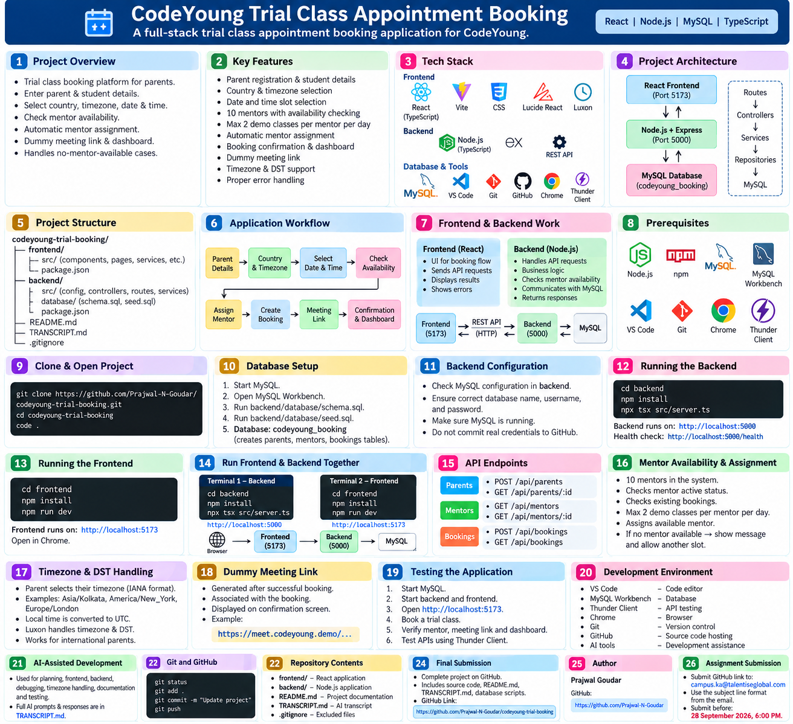

# CodeYoung Trial Class Appointment Booking

A full-stack trial class appointment booking application developed for the CodeYoung Full-Stack Development assignment.

 Project Guide




---

## 1. Project Overview

- Trial class booking platform for parents.
- Parent and student details collection.
- Date, time, country and timezone selection.
- Mentor availability checking.
- Automatic mentor assignment.
- Dummy live-class meeting link.
- Booking confirmation and dashboard.
- Handles no-mentor-available situations.

---

## 2. Key Features

- Parent registration
- Student details
- Country and timezone selection
- Date and time selection
- Mentor availability
- Maximum 2 demo classes per mentor per day
- Automatic mentor assignment
- Booking confirmation
- Dummy meeting link
- Dashboard
- No-mentor availability handling
- Timezone and DST support

---

## 3. Tech Stack

**Frontend**
- React
- TypeScript
- Vite
- React Router
- CSS
- Lucide React
- Luxon

**Backend**
- Node.js
- Express.js
- TypeScript
- REST API

**Database**
- MySQL
- MySQL Workbench

**Tools**
- Visual Studio Code
- Git
- GitHub
- Chrome
- Thunder Client

---

## 4. Project Architecture

```text
React Frontend
      ↓
REST API
      ↓
Node.js + Express
      ↓
Routes
      ↓
Controllers
      ↓
Services
      ↓
Repositories
      ↓
MySQL Database

codeyoung-trial-booking/
├── frontend/
├── backend/
│   ├── src/
│   └── database/
│       ├── schema.sql
│       └── seed.sql
├── README.md
├── TRANSCRIPT.md
└── .gitignore

Parent
  ↓
Book Trial Class
  ↓
Parent & Student Details
  ↓
Country & Timezone
  ↓
Select Date
  ↓
Select Time
  ↓
Check Mentor Availability
  ↓
Assign Mentor
  ↓
Create Booking
  ↓
MySQL Database
  ↓
Meeting Link
  ↓
Booking Confirmation
  ↓
Dashboard

How Frontend and Backend Work
- React handles the user interface and booking flow.
- Frontend sends requests to the backend using REST APIs.
- Express handles API routes.
- Controllers process requests.
- Services handle business logic.
- Repositories communicate with MySQL.
- Backend sends the result back to React.   Frontend → API → Backend → MySQL
Frontend ← API ← Backend ← MySQL


git clone https://github.com/Prajwal-N-Goudar/codeyoung-trial-booking.git
cd codeyoung-trial-booking
code .


Start MySQL.
Open MySQL Workbench.
Open backend/database/schema.sql.
Execute the schema.
Run backend/database/seed.sql.
Verify the required tables and mentor data.
codeyoung_booking

- Check the MySQL configuration in the backend.
- Make sure MySQL is running.
- Ensure the database name, username and password match your local MySQL setup.
- Do not upload real passwords or secrets to GitHub.


MAIN STEPS:
**Running the Backend
Open Terminal 1: cd backend
npm install
npx tsx src/server.ts
 http://localhost:5000

**Running the Frontend
Open Terminal 2:cd frontend
npm install
npm run dev
http://localhost:5000


Browser
   ↓
Frontend :5173
   ↓
Backend :5000
   ↓
MySQL


Repository Contents:
frontend/
backend/
README.md
TRANSCRIPT.md
.gitignore


Final Submission
The completed project is available on GitHub.
https://github.com/Prajwal-N-Goudar/codeyoung-trial-booking

Complete source code
README.md
TRANSCRIPT.md
Database scripts
Frontend
Backend


